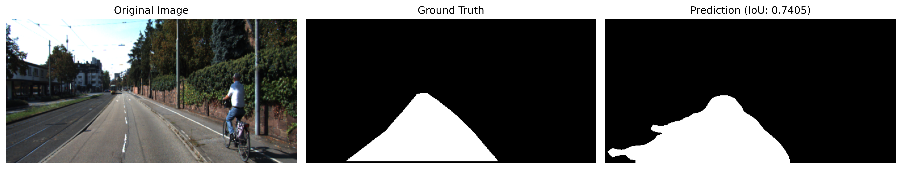
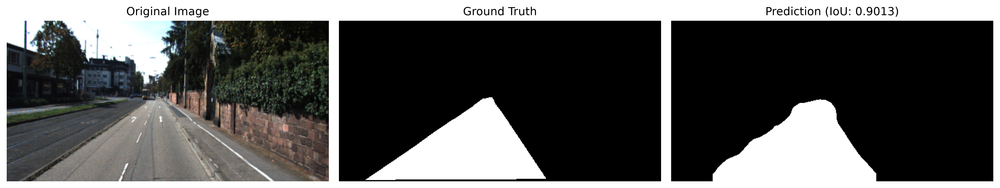
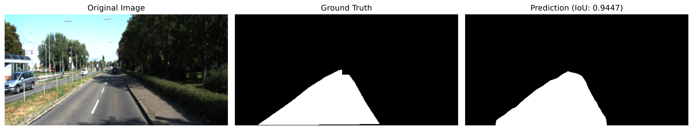
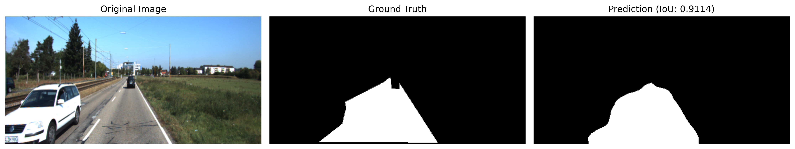

## Results

The model was evaluated on a fixed 20% validation split containing 58 images.

### Model Comparison

| Model | Validation IoU |
|---|---:|
| Frozen DeepLabV3-ResNet50 | 25.01% |
| Fine-tuned DeepLabV3-ResNet50 (`layer4`) | **84.92%** |

### Fine-Tuned Model Metrics

| Metric | Score |
|---|---:|
| IoU | **84.92%** |
| Dice | **91.85%** |

The fine-tuned model achieved a validation IoU of **84.92%** and a Dice score of **91.85%**.

### Qualitative Results

